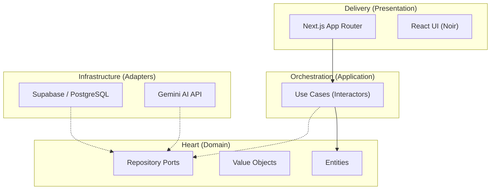

# <p align="center">💎 Lumacraft</p>
### <p align="center">The High-Performance, AI-Native Dynamic Data Engine</p>

<p align="center">
  
  
  
  
  
</p>

---

**Lumacraft** is a premium, open-source platform-builder designed to orchestrate complex dynamic data structures with the precision of a master artisan. Inspired by the flexibility of Airtable and the robustness of Supabase, it empowers organizations to build custom data engines, intelligent document generators, and AI-native workflows in a multi-tenant, zero-trust environment.

## 🌟 The Core Pillars

<table width="100%">
  <tr>
    <td width="33%" align="center">
      <h3>⚡ Data Engine</h3>
      <p>Dynamic collections and fields with strict PostgreSQL-level validation. Relationships at scale (1:1, 1:N, N:M) with referential integrity.</p>
    </td>
    <td width="33%" align="center">
      <h3>🧠 AI Brain</h3>
      <p>Native integration with Google Gemini. Context-aware content generation that understands your data schema and business rules.</p>
    </td>
    <td width="33%" align="center">
      <h3>📄 Doc Forge</h3>
      <p>High-fidelity document generation. From a visual WYSIWYG editor to pixel-perfect PDFs using a server-side rendering pipeline.</p>
    </td>
  </tr>
</table>

---

## 🏛️ Engineering Excellence

Lumacraft isn't just code; it's a statement on software architecture. Built with **Screaming + Hexagonal Architecture**, we ensure that business logic remains pure, testable, and completely decoupled from infrastructure details.



- **Domain-Driven Design (DDD)**: Logic isolated in the heart of the system.
- **Valid by Construction**: We use Value Objects to prevent illegal states.
- **Result Pattern**: Uniform, functional error handling (no hidden exceptions).

---

## 🎨 UI Luxe: Noir Minimalist

Experience a dashboard that feels like a high-end physical object. 
- **Integrated Aesthetics**: A flat, Noir Minimalist UI that prioritizes signal over noise.
- **Micro-interactions**: Fluid transitions and hover effects that feel alive.
- **Adaptive Precision**: Native Light and Dark patterns using a unified CSS token system.

---

## 🚀 Quick Start

Ensure you have **Node.js 22.x** and a **Supabase** instance ready.

1.  **Clone & Install**
    ```bash
    git clone https://github.com/cjuriartec/lumacraft.git && cd lumacraft
    npm install
    ```

2.  **Forge the Environment**
    Our automated script handles the heavy lifting of setting up your local Supabase instance:
    ```bash
    npm run supabase:local
    ```

3.  **Launch**
    ```bash
    npm run dev
    ```

---

## 🗺️ Roadmap & Evolution

- [x] **Genesis**: Core Data Engine & RBAC.
- [x] **Nexus**: Complex Relationship Engine & RLS isolation.
- [x] **Prism**: Visual Template Editor (Plate.js integration).
- [x] **Flux**: Contextual AI Generation & PDF High-Fidelity Pipeline.
- [ ] **Automata**: Self-triggering Workflows & Event Engine.

---

## 🤝 Community & Contribution

We seek contributors who value craft over speed. Please read our **[Contributing Guidelines](CONTRIBUTING.md)** to understand our architectural standards before opening a PR.

---

## 📄 License

Lumacraft is open-source software licensed under the **[MIT License](LICENSE)**.

---

<p align="center">
  Built with passion for the artisans of the web.
</p>
