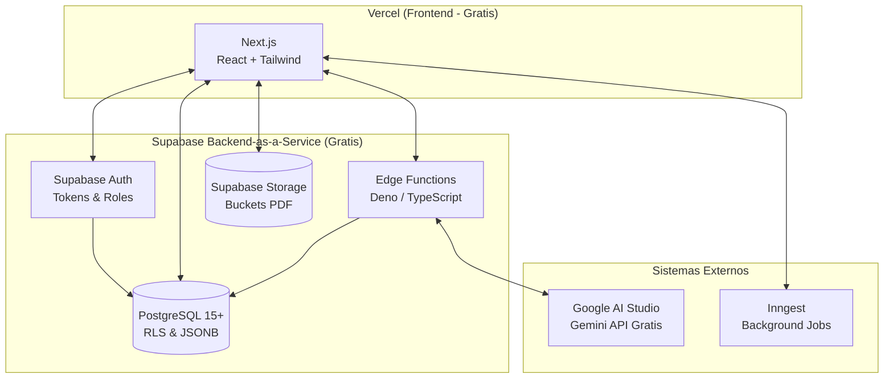

# 💸 Arquitectura Free Tier: Supabase BaaS (MVP $0/mes sin Cold Starts)

Dado que es inaceptable tener tiempos de carga lentos (_Cold Starts_ en Render/Railway) y necesitamos una solución integral que también cubuya almacenamiento (Storage) para los documentos generados, la estrategia definitiva es **reemplazar el Backend tradicional (NestJS) por Supabase**.

Al usar Supabase como un "Backend-as-a-Service" (BaaS), eliminamos la necesidad de mantener un servidor en Node.js despierto, y delegamos la API, Base de Datos, Autenticación y Storage a una sola plataforma en su capa gratuita (Free Tier).

---

## 🏗️ 1. Infraestructura Core

**Estrategia**: **Next.js (Frontend en Vercel)** + **Supabase (Backend, Auth & DB)**.

- **Frontend**: Desplegado en **Vercel** ($0). Infinitamente escalable y siempre rápido.
- **Backend (API)**: Ya no programaremos controladores ni endpoints en NestJS. Next.js interactuará directamente con la base de datos de Supabase vía el SDK oficial (`@supabase/supabase-js`).
- _Adiós a los Cold Starts_: Supabase no suspende tu servidor cada 15 minutos (a diferencia de Render). Solo pausa el proyecto si pasa **1 semana entera sin actividad**, lo cual no ocurrirá si lo estás usando activamente o lo pingeas.

## 🗄️ 2. Base de Datos y Lógica de Negocio

**Recomendación**: **Supabase (PostgreSQL 15)**.

- Mantenemos el **esquema original** de la base de datos (PostgreSQL, tipos `JSONB`, Enums, motor de grafos). Todo eso es soportado nativamente por Supabase.
- **Row Level Security (RLS)**: En lugar de hacer "Guards" en NestJS, programaremos las reglas de seguridad y permisos granulares (`collection_permissions`) directamente en las políticas RLS de PostgreSQL. Así, si un usuario no tiene permiso, la base de datos rechaza la consulta nativamente.

## 🔐 3. Autenticación y Almacenamiento

**Recomendación**: **Ecosistema Supabase**.

- **Supabase Auth**: Reemplaza a Auth.js y Passport. Te brinda login con Google OAuth de caja automática y guarda los usuarios en la tabla interna de Supabase, simplificando la sincronización de permisos. (Límite enorme: 50,000 usuarios activos mensuales gratis).
- **Supabase Storage**: Reemplaza a Cloudflare R2 / AWS S3. Te da 1GB gratuito para almacenar los PDFs/DOCX autogenerados. Se accede directo desde el SDK.

## 🤖 4. Cerebro de IA y Lógica Compleja (Edge Functions)

**Recomendación**: **Supabase Edge Functions + Google AI Studio**.

- ¿Dónde ponemos el código para llamar a la IA (Gemini API) o ejecutar flujos complejos sin exponer llaves secretas? Usaremos las **Edge Functions** de Supabase (o Server Actions de Next.js).
- _Google Gemini Free Tier_: Sigue siendo el cerebro oficial (1 millón de tokens por minuto gratis).

## ⚡ 5. Colas y Automatizaciones (Workflows)

**Recomendación**: **Supabase Webhooks + pg_cron** o **Inngest**.

- Podemos usar **Triggers nativos en PostgreSQL** integrados con Supabase Webhooks para ejecutar acciones inmediatas (ej. Al insertar un registro, envíalo a una API externa). Para flujos más visuales, **Inngest** sigue siendo la mejor opción complementaria gratuita sin necesidad de encender un servidor Redis.

---

## 🗺️ Mapa de Arquitectura Visual (Costo $0)

### 💡 Resumen del Stack Final para Lumacraft

Al tomar esta ruta, tu stack es extremadamente magro (Lean) y potente:
**`Next.js (Vercel)` + `@supabase/supabase-js` + `Supabase Auth` + `Supabase Storage` + `Google Gemini API`.**

Hemos matado NestJS y dependencias externas pesadas, asegurando tiempos de respuesta rápidos (sin Cold Starts) y un MVP robusto ideal para empezar. Si el sistema de "Tablas Dinámicas" se vuelve ridículamente complejo a futuro, siempre podremos reescribir microservicios en NestJS consumiendo la misma base de datos de Supabase.
